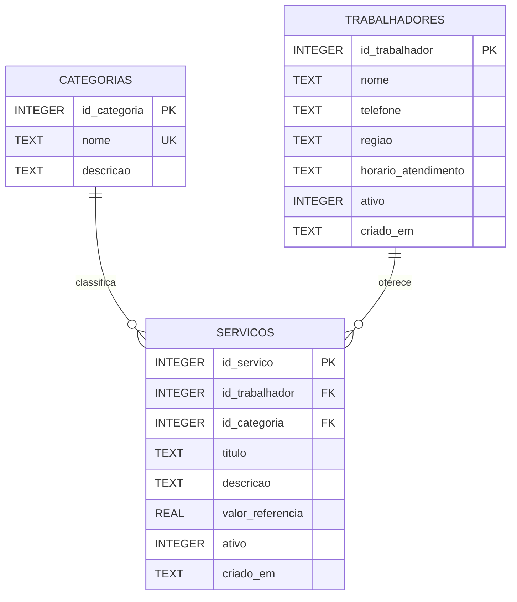

# Modelo de banco de dados

Este arquivo apresenta a modelagem inicial do banco de dados da Plataforma Digital para Divulgação de Serviços de Trabalhadores Autônomos da Comunidade.

## Entidades

- **categorias**: armazena os tipos de serviço disponíveis na plataforma.
- **trabalhadores**: armazena os dados básicos dos profissionais autônomos.
- **servicos**: armazena os serviços divulgados e liga cada serviço a um trabalhador e a uma categoria.

## Relacionamentos

- Uma categoria pode possuir vários serviços.
- Um trabalhador pode divulgar vários serviços.
- Cada serviço pertence a uma categoria e a um trabalhador.

